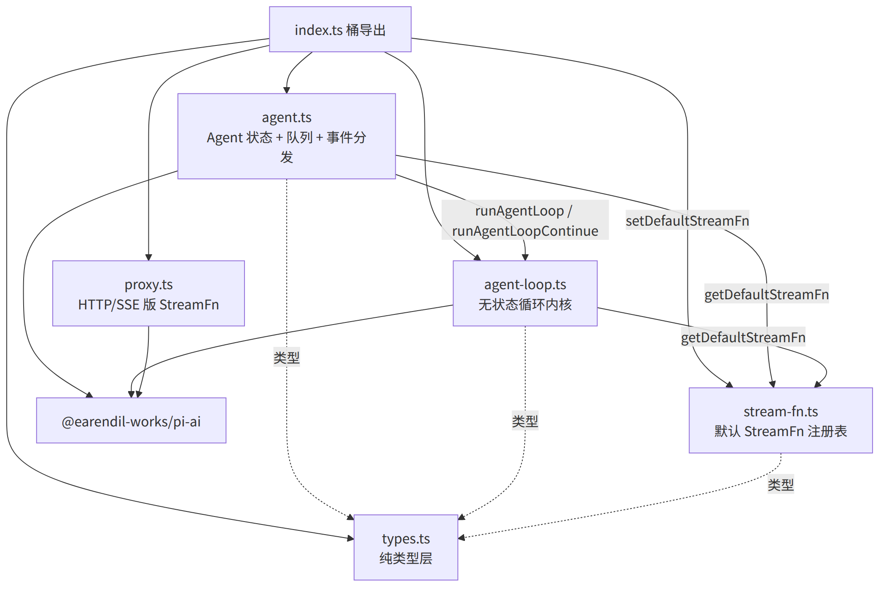
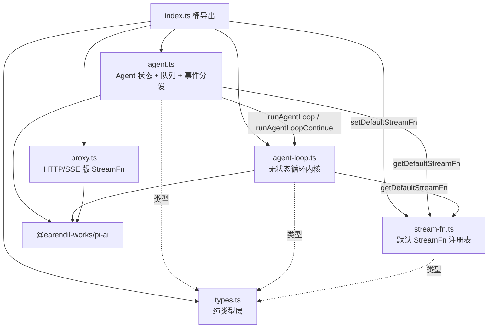
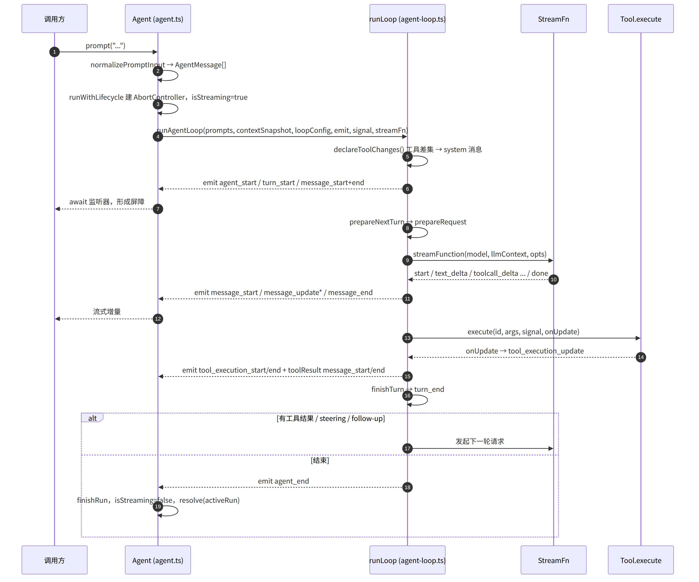
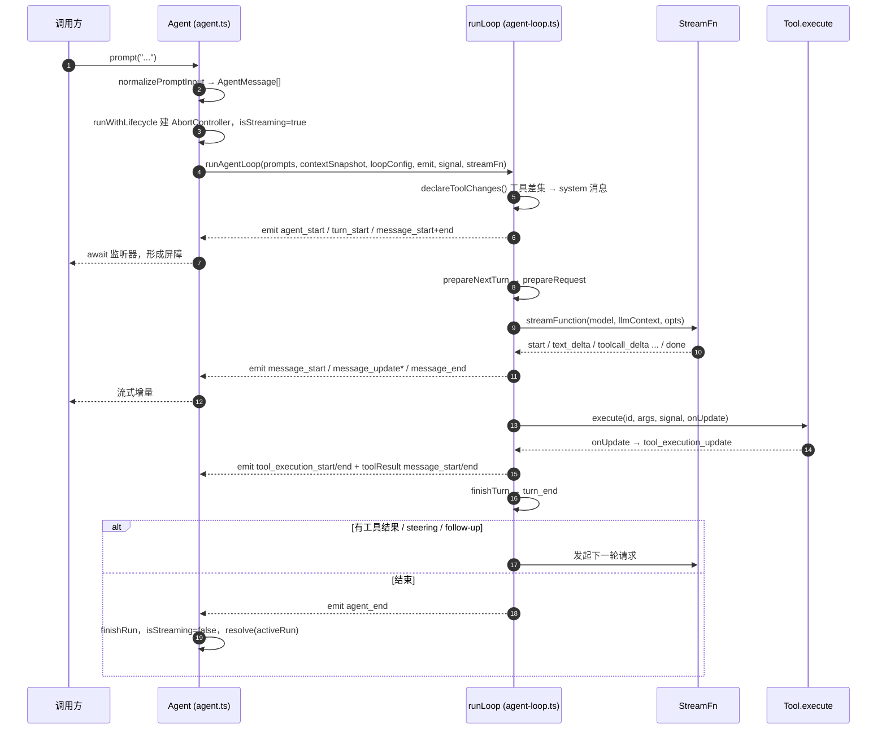
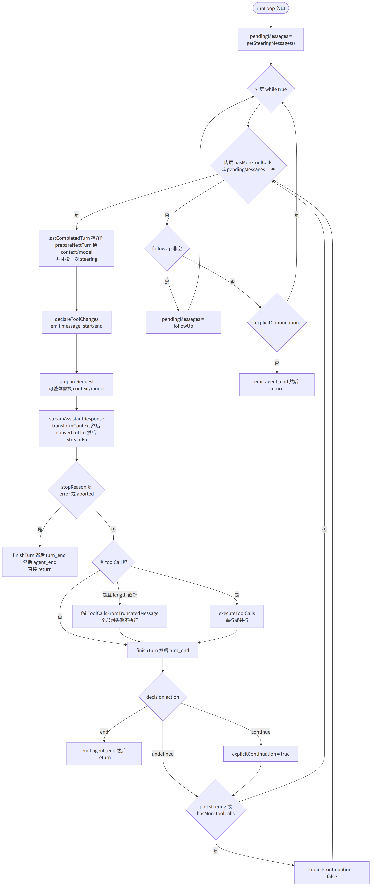
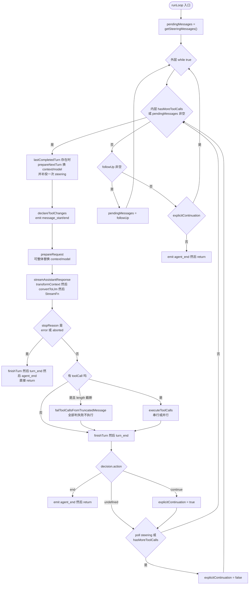
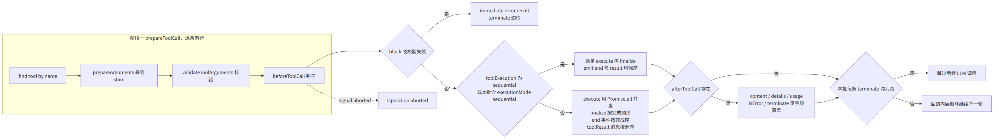
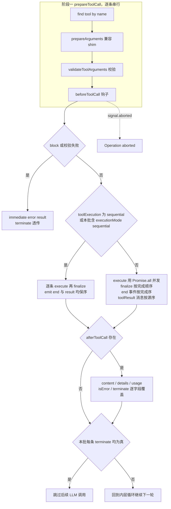
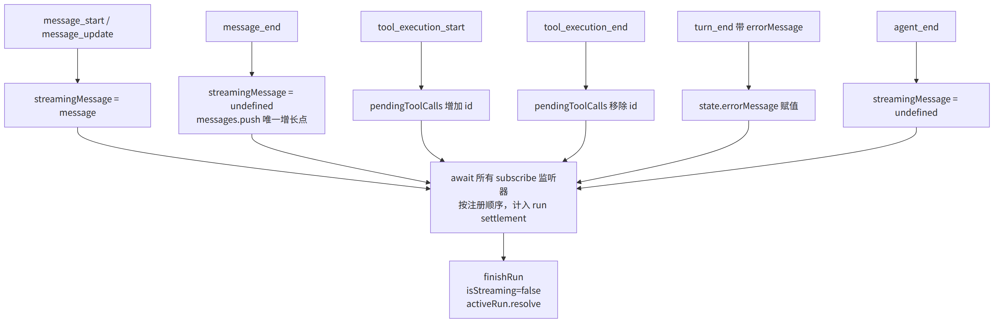
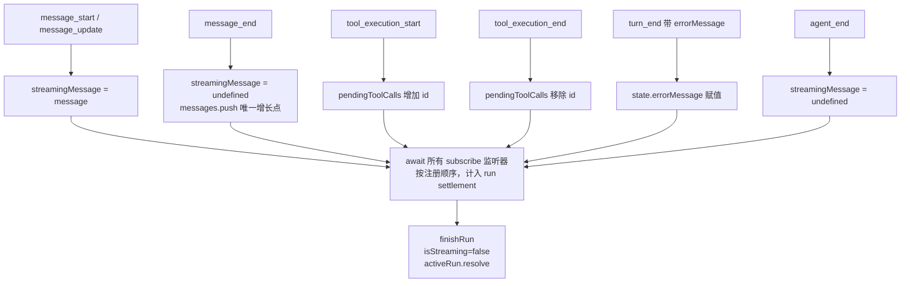

# packages/agent 内部执行关系图

对应源码：[`packages/agent/src`](../../packages/agent/src)。图片由 [mermaid-cli](https://github.com/mermaid-js/mermaid-cli) 从同目录 `*.mmd` 渲染，中文字体使用 Noto Sans CJK SC。

重新渲染单个图：

```bash
npx -y @mermaid-js/mermaid-cli@11.17.0 \
  -i 01-module-dependencies.mmd -o 01-module-dependencies.png \
  -p puppeteer-config.json -c mermaid-config.json -b white -s 2 -w 1600
```

## 图 1：模块静态依赖（单向无环）





## 图 2：prompt() 调用时序





## 图 3：runLoop 双层控制流





## 图 4：工具执行三段式与两种模式





## 图 5：事件到状态回写





