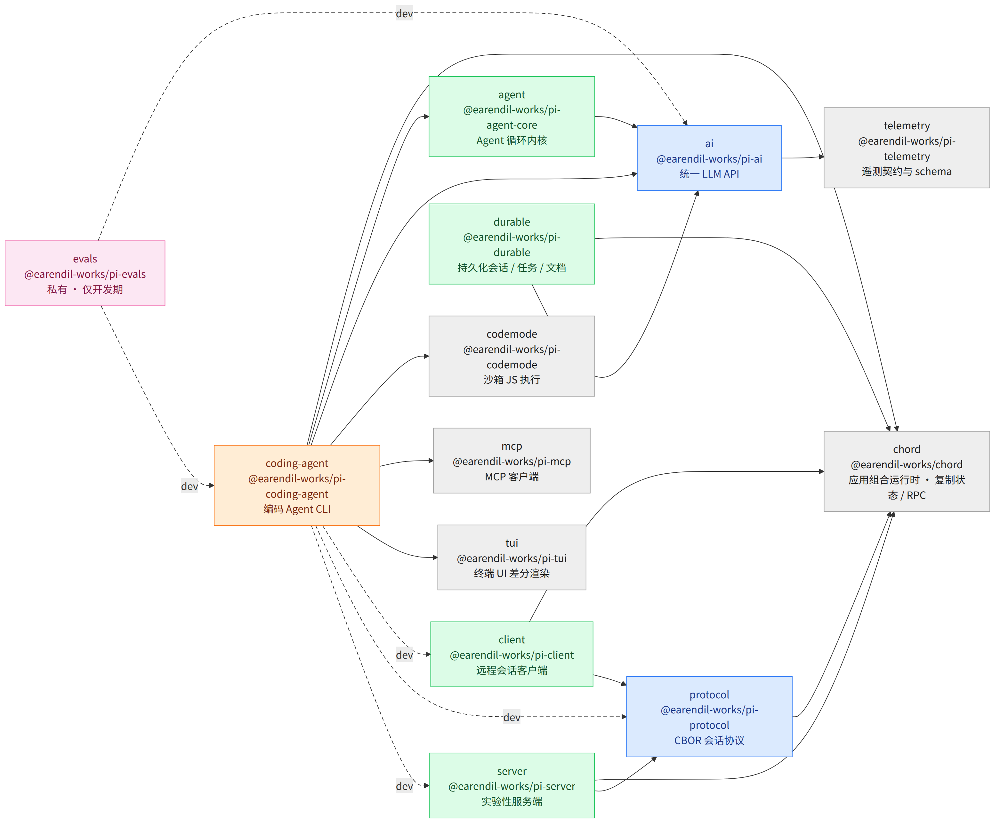
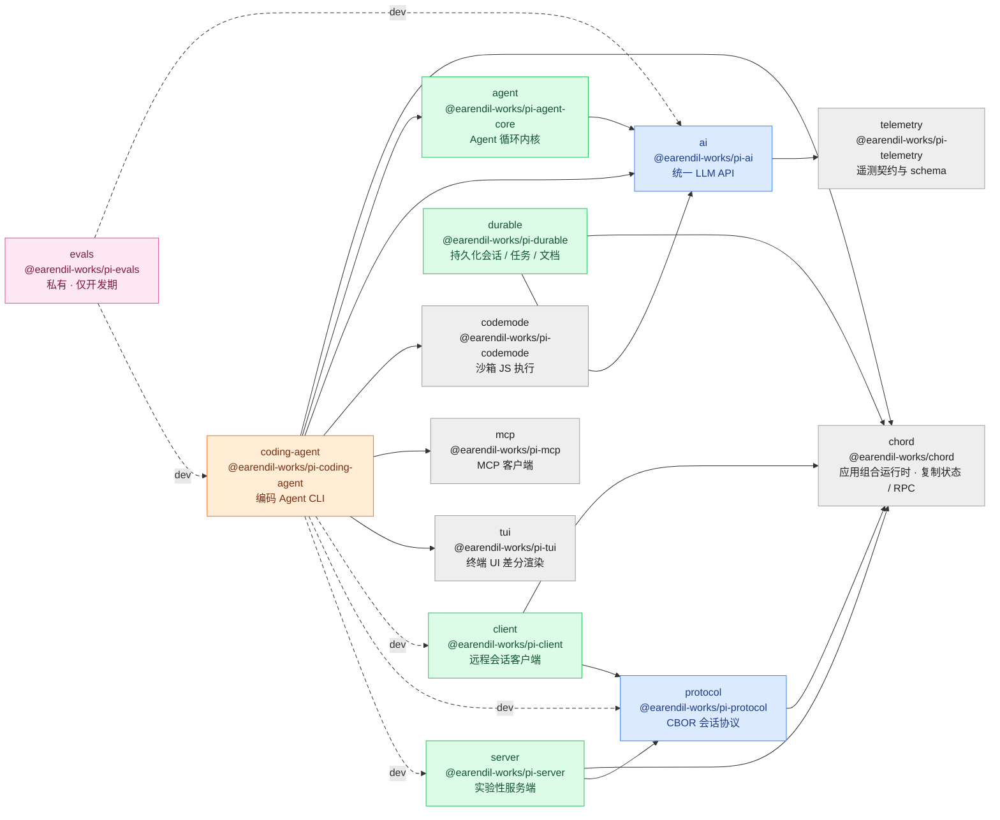
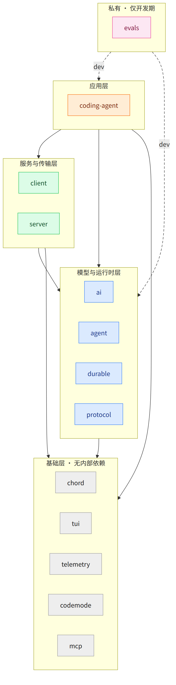
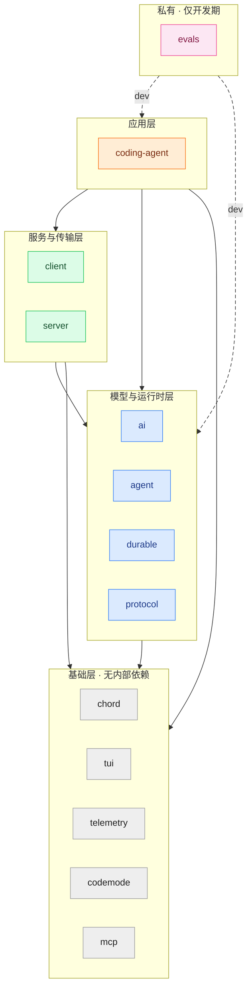

# pi monorepo 包间依赖图

`packages/` 下 13 个 workspace 包之间的内部依赖关系。图片由 [mermaid-cli](https://github.com/mermaid-js/mermaid-cli) 从同目录 `*.mmd` 渲染，中文字体 Noto Sans CJK SC。

**颜色 = 依赖层级**（灰色为最底层，必须最先构建）：

| 颜色 | 层级 | 包 |
| --- | --- | --- |
| 灰 | 基础层 · 无内部依赖 | `chord` `tui` `telemetry` `codemode` `mcp` |
| 蓝 | 模型与运行时层 | `ai` `protocol` |
| 绿 | 服务与传输层 | `agent` `durable` `client` `server` |
| 橙 | 应用层 | `coding-agent` |
| 粉 | 私有 · 仅开发期 | `evals` |

**实线 = `dependencies`（运行时依赖），虚线 `dev` = `devDependencies`（仅开发期）。**

## 图 1：包间依赖全图





## 图 2：分层总览





## 依赖边清单

| 来源 | 目标 | 类型 |
| --- | --- | --- |
| `agent` | `ai` | dependencies |
| `ai` | `telemetry` | dependencies |
| `client` | `chord` | dependencies |
| `client` | `protocol` | dependencies |
| `coding-agent` | `chord` | dependencies |
| `coding-agent` | `agent` | dependencies |
| `coding-agent` | `ai` | dependencies |
| `coding-agent` | `codemode` | dependencies |
| `coding-agent` | `mcp` | dependencies |
| `coding-agent` | `tui` | dependencies |
| `durable` | `chord` | dependencies |
| `durable` | `ai` | dependencies |
| `protocol` | `chord` | dependencies |
| `server` | `chord` | dependencies |
| `server` | `protocol` | dependencies |
| `coding-agent` | `client` | devDependencies |
| `coding-agent` | `protocol` | devDependencies |
| `coding-agent` | `server` | devDependencies |
| `evals` | `ai` | devDependencies |
| `evals` | `coding-agent` | devDependencies |

## 第三方依赖（非 workspace）

| 包 | 运行时依赖 |
| --- | --- |
| `agent` | `typebox` |
| `ai` | `@anthropic-ai/sdk` `@aws-sdk/client-bedrock-runtime` `@google/genai` `@smithy/node-http-handler` `http-proxy-agent` `https-proxy-agent` `openai` `partial-json` `typebox` |
| `chord` | `esbuild` |
| `client` | — |
| `codemode` | `quickjs-wasi` |
| `coding-agent` | `@silvia-odwyer/photon-node` `brace-expansion` `chalk` `cross-spawn` `diff` `grok-mermaid` `highlight.js` `hosted-git-info` `ignore` `jiti` `minimatch` `proper-lockfile` `quickjs-wasi` `semver` `typebox` `undici` `yaml` |
| `durable` | `diff` `typebox` |
| `evals` | — |
| `mcp` | `cross-spawn` |
| `protocol` | `typebox` |
| `server` | — |
| `telemetry` | — |
| `tui` | `get-east-asian-width` `marked` |

## 复现

```bash
npx -y @mermaid-js/mermaid-cli@11.17.0 \
  -i 06-monorepo-package-deps.mmd -o 06-monorepo-package-deps.png \
  -p puppeteer-config.json -c mermaid-config.json -b white -s 2 -w 2000
```

> 依赖数据取自各包 `package.json` 的 `dependencies` / `devDependencies`，只保留指向本 monorepo 其他 workspace 的边；`packages/coding-agent/examples/extensions/*` 下的示例 workspace 未纳入。
