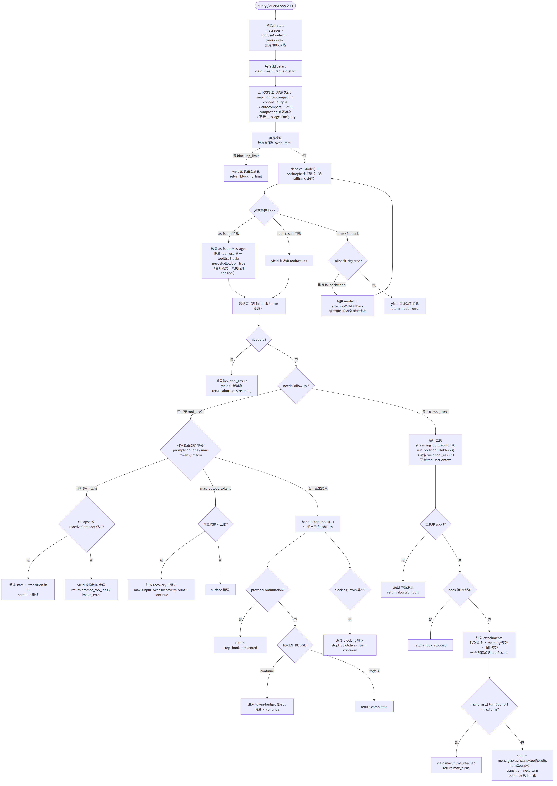
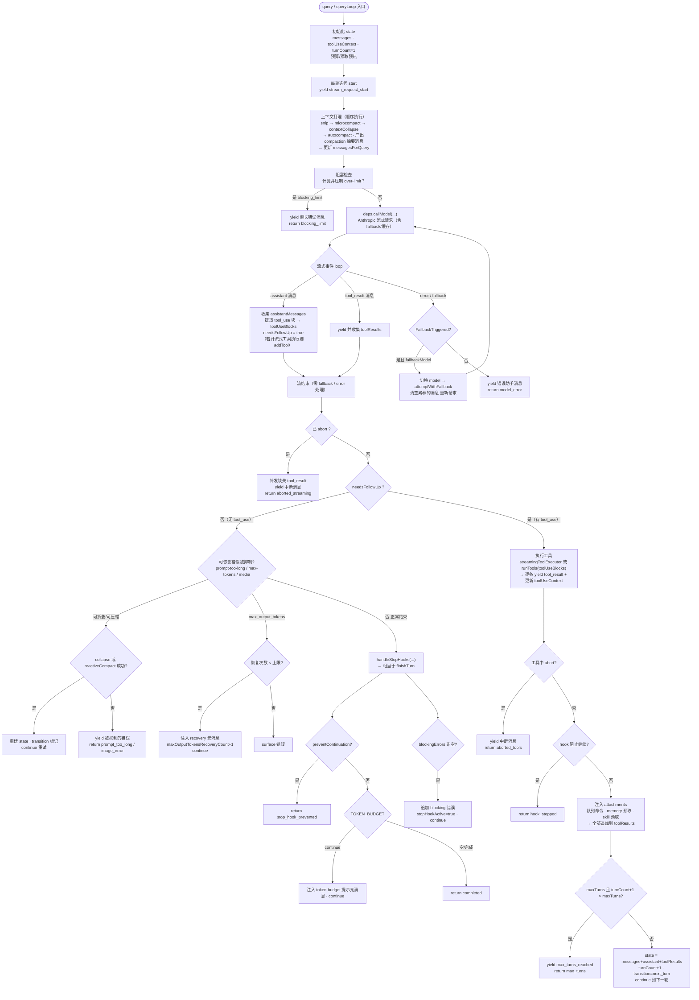
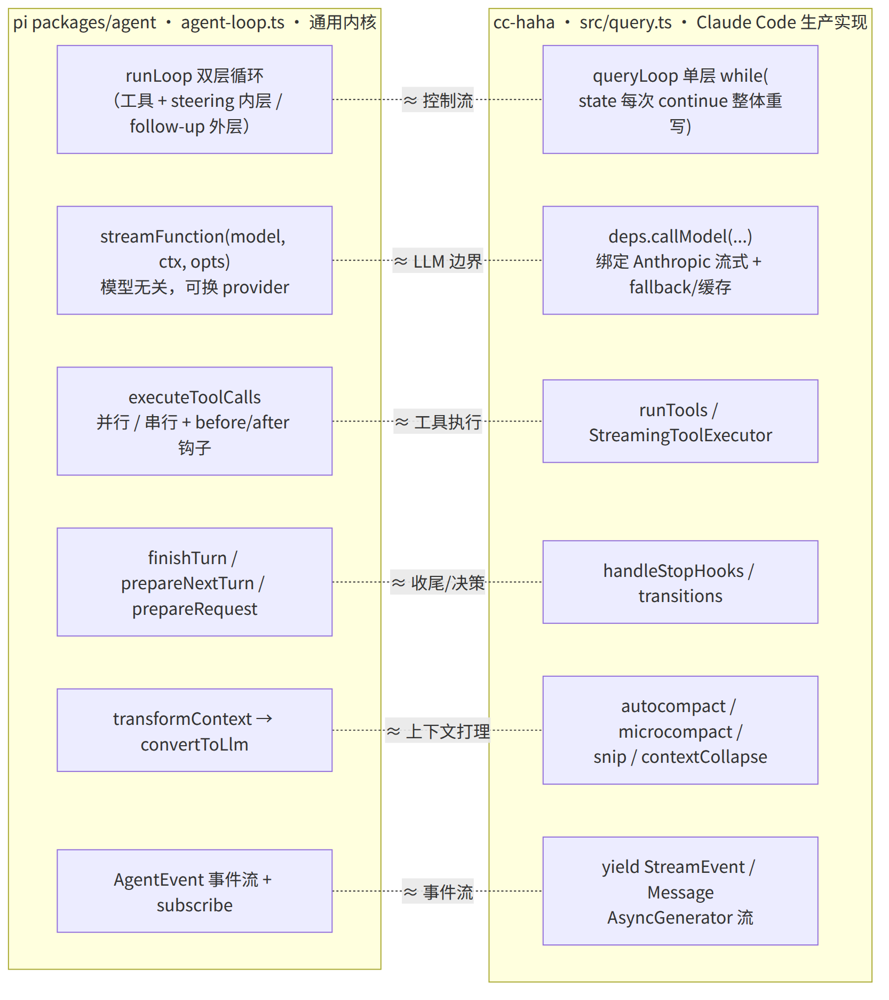
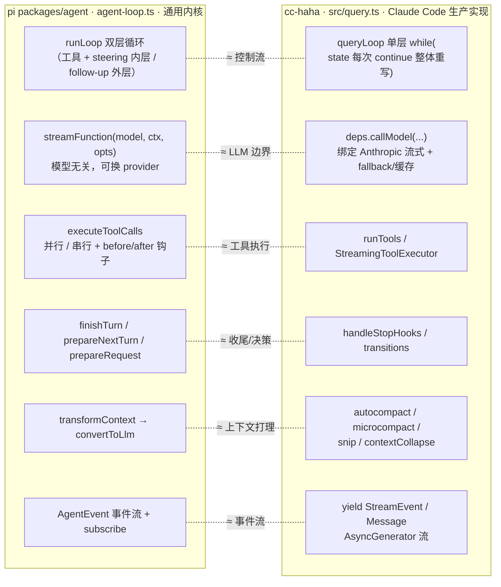

# cc-haha 的 agent 循环 —— 与 pi `agent-loop.ts` 对照

这个仓库是 **Claude Code 的衍生版**。与 pi `packages/agent` 的 `agent-loop.ts` 最直接对应的是 `src/query.ts` 里的 `queryLoop()`（约 244–1737 行，主循环 `while (true)` 在 310 行）。

> 图 1 由 [mermaid-cli](https://github.com/mermaid-js/mermaid-cli) 从同目录 `08-queryLoop-control-flow.mmd` 渲染，中文字体 Noto Sans CJK SC。

## pi ↔ cc-haha 一一对照

