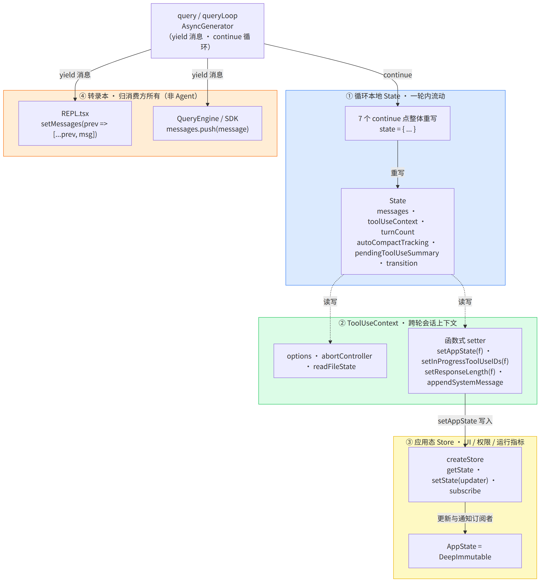
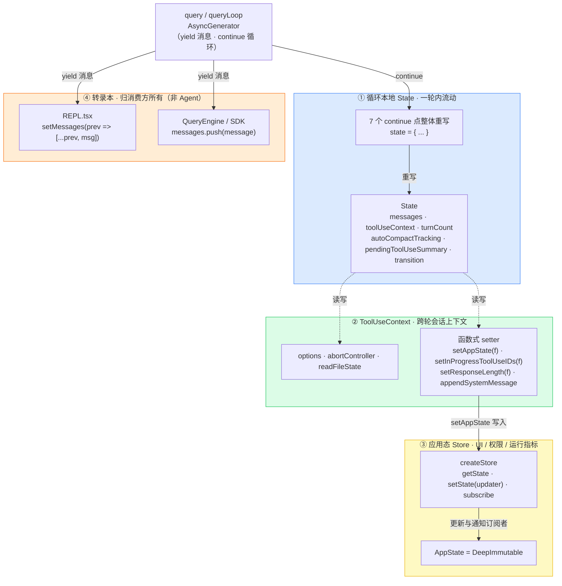
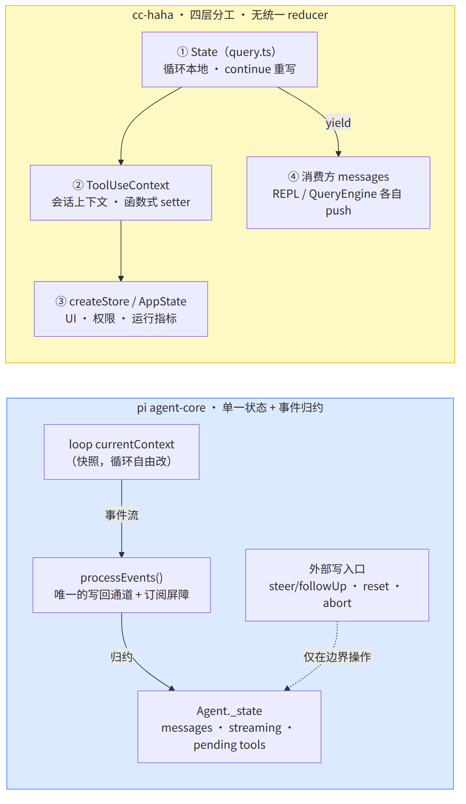
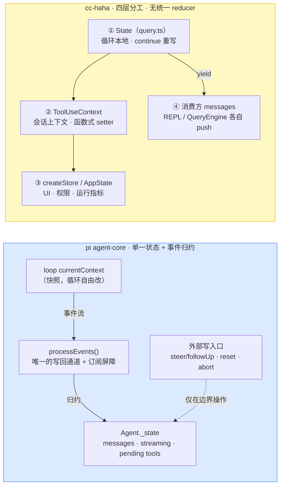

# cc-haha 的 state 控制 —— 与 pi 对照

cc-haha 没有 pi `agent-core` 那种「单一状态对象 + 事件归约」，而是**四层分工、无统一 reducer**：循环本地 `State`、`ToolUseContext`、应用态 Store、消费方转录本。

## 图 1：cc-haha 四层 state 架构

> 图由 [mermaid-cli](https://github.com/mermaid-js/mermaid-cli) 从同目录 `10-cc-haha-state-control.mmd` 渲染，中文字体 Noto Sans CJK SC。

## 图 2：pi ↔ cc-haha 状态模型对照

